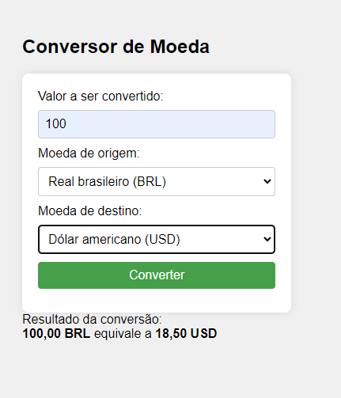

### `index.php`

Este é o arquivo principal que contém a lógica do conversor de moedas. Ele inclui o formulário HTML para inserção dos valores e seleção das moedas, além do código PHP para buscar as cotações e realizar a conversão.

### `estilo.css`

Este arquivo contém os estilos CSS para a formatação da interface do usuário.

### `README.md`

Este arquivo descreve o projeto, suas funcionalidades, tecnologias utilizadas e instruções de uso.

### `assets/screenshot.png`

Este arquivo contém uma captura de tela do projeto em funcionamento.

## Captura de Tela

## Instruções de Uso

### Pré-requisitos

- Um servidor web com suporte para PHP (por exemplo, Apache, Nginx).
- Acesso à internet para fazer requisições à API do Banco Central.

### Configuração do Projeto

1. Clone o repositório ou faça o download dos arquivos do projeto.
2. Coloque os arquivos em um diretório acessível pelo seu servidor web.
3. Certifique-se de que o servidor web está configurado corretamente e está em execução.

### Executando o Projeto

1. Acesse o projeto através do seu navegador web. Por exemplo, se você estiver executando o servidor localmente, você pode acessar `http://localhost/conversor-de-moedas/`.
2. Insira o valor que deseja converter.
3. Selecione a moeda de origem e a moeda de destino.
4. Clique no botão "Converter".
5. O valor convertido será exibido na tela.

### Exemplo de Uso

1. Insira o valor a ser convertido no campo "Valor a ser convertido".
2. Selecione a moeda de origem no menu suspenso "Moeda de origem".
3. Selecione a moeda de destino no menu suspenso "Moeda de destino".
4. Clique em "Converter".
5. O resultado da conversão será exibido na tela.

## Funcionamento Interno

1. O usuário preenche o formulário e envia os dados.
2. O PHP verifica os campos enviados e, se estiverem corretos, busca as cotações necessárias usando a função `buscar_cotacao`.
3. A função `buscar_cotacao` constrói a URL da API do Banco Central com base nas moedas e datas fornecidas, faz a solicitação HTTP e retorna a cotação.
4. O PHP calcula o valor convertido e exibe o resultado para o usuário.

## Observações

- A API do Banco Central fornece cotações com base em datas e
